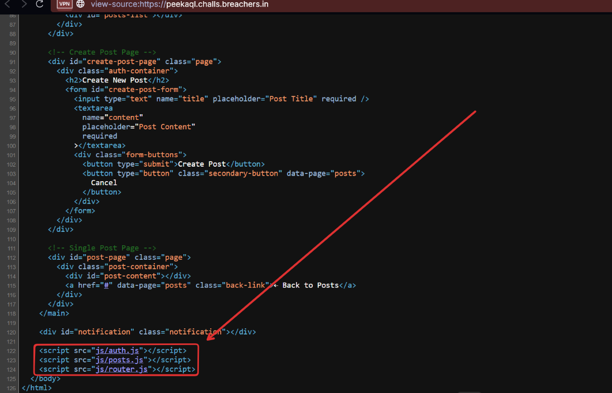
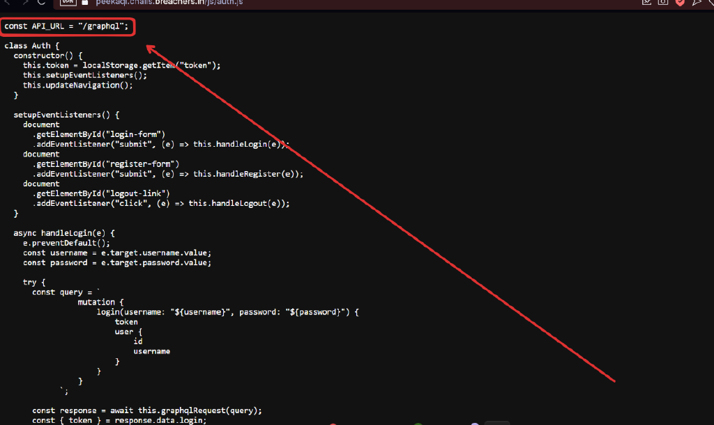
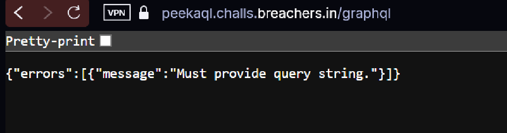
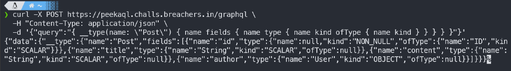
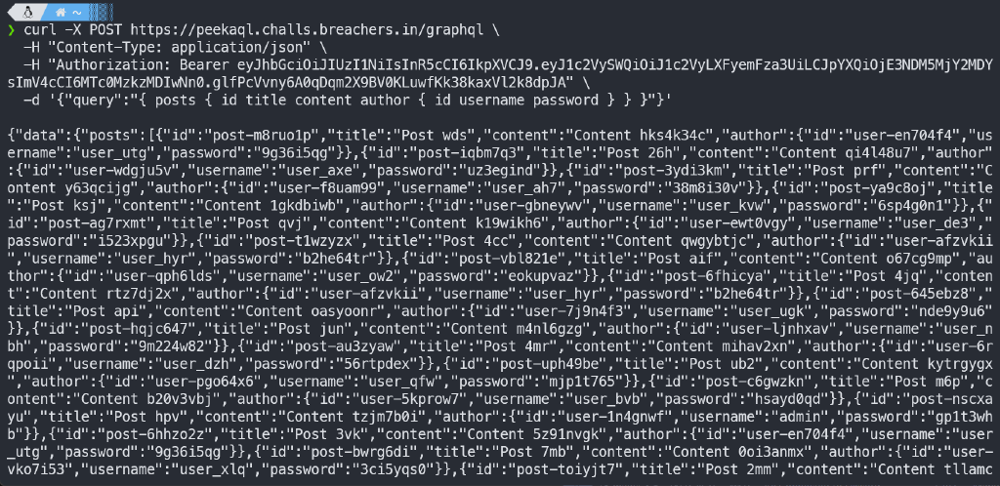

Hello there! today i will share my write-up challs that i solved in `Breach CTF`, and i play with `TCP1P` Cybersecurity Team!! and we on position `9` of 194 teams!!

I managed to solve 1 Reversing, 1 Webex, 1 Crypto, and 1 Misc, and this is my write-up…

## Fraction fun
```txt 
Challenge Name: Fraction fun
Category: Reverse Engineering
Points: 50
Author: Niral
```
I got zip file, i extracted it, and i got `server.py`, `code.txt`, and `output.txt`

`server.py`:
```py
def execute(code, inp):
    values = code.split(" ")
    inp = int(inp)
    a = [int(i.split("/")[0]) for i in values]
    b = [int(i.split("/")[1]) for i in values]
    ...
    for _ in range(1000):
        changed = False
        for i in range(len(a)):
            if inp % b[i] == 0:
                inp = inp * a[i] // b[i]
                changed = True
        if not changed:
            break
    ...
    return inp
```
`code.txt`:
```txt
132037/2 5053/3 6179/5 11923333/7 26314511297/11 4309842885778741/13 1507081871/17 8140842992713/19 2303746780288325777/23 31/37 29/31 43/47 41/43 59/61 53/59 257/29 277/41 307/53 59851837/157 380692393061/163 179840600492380063/167 8841668387/173 74869345501501/179 81633042063844053697/181 2248751/191 24341/193 25853/197 71/73 67/71 83/89 79/83 101/103 97/101 263/67 281/79 283/97 131079601/199 1677100110841/211 3004041937984268273/223 16129/227 131/229 137/233 2685619/239 73439775749/241 270281038127131201/251 109/113 107/109 131/137 127/131 149/151 139/149 269/107 271/127 293/139
```
`output.txt`:
```txt
26583695521295564229597702539606779011424487630673118238848488250483324638316493786570869155140262109049480728720762458861072382684496180304334780580927278480859828726271190354563801424026577071092295383902034809987118743623980912225475900244424293925091408859063688998972149202047364837931904804899042122574503994569600746938637960913073394707892294153090918898328022107247581272863802253341432320938165400233000775086785908939290420113613066550342438527239433033068361060160630630082143980259608478649688184001887031227134526555373378453043380082886248214045569103863602855235129007027468851693345088850218355279083544799043710805153297299609903475798568030451596050516808739152859459909989354534948107258456557490085460286436562247329508838657444598086742992481999935339366611914188475448009484000721883947866826487274989647499669472627139328680685664054694766806899629567782668520200835436391615456137547263096541357115999084091125914898574531262690211384194317518215317516788665114719421885068620084565914276013819753391228437274756802904194382475006545796394208126066131704391781275616585871926844307150203052130711672595603719081095076166720941879003314070745909826291196703785409557136061565397541026718608726589513196689900333744709590748515676202353872332605737968135033
```
### Code Analysis
`server.py:`
1. It loops up to 1000 times
2. If `inp` is divisible by `b[i]`, then it replaces `inp with (inp * a[i]) // b[i]`
3. Once no more rules apply, the loop breaks.

To reverse this logic, we do the opposite:

1. Instead of multiplying and dividing, we will multiply by `b[i]` and divide by `a[i]`.
2. Then we perform `inp = inp * b[i] // a[i]`

### Solver
```py
code = open("code.txt").read().strip().split(" ")
output = int(open("output.txt").read())

a = [int(i.split("/")[0]) for i in code]
b = [int(i.split("/")[1]) for i in code]

inp = output

for _ in range(1000):
    changed = False
    for i in range(len(a)):
        if inp % a[i] == 0:
            inp = inp * b[i] // a[i]
            changed = True
    if not changed:
        break

print(inp)
```
Copy from the output and paste it into the server, and we got the flag: 
`Breach{0n3_0f_c0nw4y5_7ur1n6_c0mpl373_w0nd3r5}`

## Taaffeite Encryption
```txt
Challenge Name: Taaffeite Encryption
Category: Cryptography
Points: 482
Author: Nilabha Saha
```
so i got a `tar.gz` file, when i extracted it, i got `chall.sage.py` and `data.txt`
`chall.sage.py`:
```py
# This file was *autogenerated* from the file chall.sage
from sage.all_cmdline import *   # import sage library

_sage_const_256 = Integer(256); _sage_const_3 = Integer(3); _sage_const_3329 = Integer(3329); _sage_const_2 = Integer(2); _sage_const_1 = Integer(1); _sage_const_0 = Integer(0); _sage_const_8 = Integer(8)
from secret import FLAG

degree = _sage_const_256
vec_size = _sage_const_3
p = _sage_const_3329
smallness = _sage_const_2

Q = PolynomialRing(GF(p), names=('y',)); (y,) = Q._first_ngens(1)
R = QuotientRing(Q, Q.ideal(y**degree + _sage_const_1 ), names=('x',)); (x,) = R._first_ngens(1)

def gen_small_vect():
    return vector([R([randint(_sage_const_0 ,smallness) for _ in range(degree)]) for _ in range(vec_size)])

def gen_coeffs():
    return Matrix([[R.random_element() for _ in range(vec_size)] for _ in range(vec_size)])

def encode_message(m):
    return R(sum([[int(b) for b in bin(c)[_sage_const_2 :].zfill(_sage_const_8 )] for c in m], []))

s = gen_small_vect()
coeffs = gen_coeffs()

assert len(FLAG)*_sage_const_8  <= degree
r, err1 = gen_small_vect(), gen_small_vect()
err2 = R([randint(_sage_const_0 ,smallness) for _ in range(degree)])
flag_b = encode_message(FLAG)
p_round = p//_sage_const_2  + _sage_const_1
f = p_round*flag_b
ctxt = (coeffs.T*r + err1, (coeffs*s + gen_small_vect())*r + err2 + f)

noise = randint(-vec_size**degree, vec_size**degree)
noisy_s = noise*s

with open("data.txt", 'w') as f:
    f.write(f"noisy_s: {noisy_s}\n")
    f.write(f"ctxt: {ctxt}\n")
```
`data.txt`:
```txt
noisy_s: (1479*x^255 + 1479*x^254 + 2958*x^251 + 2958*x^250 + 1479*x^247 + 2958*x^246 + 1479*x^245 + 1479*x^244 + 2958*x^243 + 2958*x^242 + 2958*x^241 + 2958*x^240 + 1479*x^238 + 2958*x^237 + 2958*x^236 + 2958*x^235 + 1479*x^234 + 1479*x^233 + 1479*x^231 + 2958*x^228 + 1479*x^227 + 2958*x^226 + 2958*x^225 + 1479*x^224 + 1479*x^221 + 1479*x^220 + 1479*x^218 + 1479*x^217 + 2958*x^216 + 1479*x^215 + 2958*x^214 + 1479*x^213 + 2958*x^212 + 2958*x^211 + 1479*x^210 + 1479*x^209 + 1479*x^206 + 2958*x^205 + 2958*x^202 + 2958*x^200 + 1479*x^199 + 2958*x^198 + 2958*x^197 + 1479*x^195 + 1479*x^194 + 1479*x^193 + 1479*x^192 + 2958*x^191 + 1479*x^190 + 2958*x^189 + 2958*x^188 + 1479*x^187 + 1479*x^186 + 2958*x^185 + 2958*x^184 + 2958*x^183 + 1479*x^182 + 2958*x^179 + 2958*x^177 + 2958*x^176 + 2958*x^175 + 1479*x^174 + 2958*x^173 + 1479*x^172 + 2958*x^170 + 2958*x^169 + 2958*x^168 + 2958*x^166 + 1479*x^165 + 1479*x^164 + 1479*x^163 + 1479*x^162 + 2958*x^161 + 2958*x^160 + 1479*x^159 + 1479*x^158 + 2958*x^157 + 1479*x^156 + 1479*x^155 + 2958*x^153 + 1479*x^150 + 2958*x^149 + 1479*x^148 + 1479*x^146 + 1479*x^145 + 2958*x^144 + 1479*x^143 + 1479*x^142 + 1479*x^141 + 2958*x^140 + 1479*x^137 + 2958*x^136 + 1479*x^134 + 1479*x^132 + 2958*x^131 + 1479*x^129 + 2958*x^128 + 2958*x^127 + 1479*x^126 + 1479*x^125 + 1479*x^124 + 1479*x^122 + 1479*x^121 + 1479*x^120 + 2958*x^119 + 2958*x^117 + 1479*x^113 + 2958*x^112 + 2958*x^109 + 1479*x^108 + 2958*x^107 + 2958*x^106 + 2958*x^105 + 1479*x^104 + 1479*x^103 + 1479*x^102 + 1479*x^101 + 1479*x^99 + 1479*x^98 + 2958*x^97 + 2958*x^96 + 2958*x^95 + 1479*x^94 + 2958*x^93 + 1479*x^91 + 2958*x^90 + 1479*x^89 + 2958*x^88 + 2958*x^87 + 2958*x^86 + 1479*x^85 + 1479*x^84 + 2958*x^83 + 1479*x^82 + 2958*x^81 + 1479*x^78 + 1479*x^77 + 2958*x^76 + 2958*x^75 + 2958*x^74 + 2958*x^73 + 2958*x^72 + 2958*x^71 + 2958*x^70 + 1479*x^68 + 1479*x^67 + 2958*x^66 + 2958*x^65 + 1479*x^62 + 1479*x^61 + 1479*x^59 + 2958*x^58 + 2958*x^57 + 2958*x^56 + 2958*x^55 + 1479*x^54 + 1479*x^53 + 2958*x^51 + 1479*x^50 + 1479*x^49 + 2958*x^45 + 1479*x^42 + 1479*x^40 + 2958*x^39 + 2958*x^37 + 1479*x^36 + 2958*x^35 + 1479*x^33 + 2958*x^29 + 1479*x^27 + 1479*x^26 + 2958*x^25 + 1479*x^23 + 2958*x^22 + 2958*x^21 + 2958*x^20 + 2958*x^19 + 1479*x^15 + 1479*x^14 + 2958*x^13 + 2958*x^12 + 1479*x^11 + 1479*x^10 + 1479*x^9 + 1479*x^8 + 2958*x^7 + 1479*x^6 + 1479*x^5 + 2958*x^2 + 2958*x + 2958, 1479*x^255 + 1479*x^254 + 1479*x^253 + 2958*x^250 + 1479*x^249 + 2958*x^247 + 1479*x^246 + 2958*x^244 + 1479*x^243 + 1479*x^242 + 2958*x^241 + 1479*x^240 + 1479*x^239 + 1479*x^238 + 1479*x^237 + 1479*x^236 + 1479*x^234 + 1479*x^232 + 1479*x^231 + 1479*x^230 + 2958*x^229 + 1479*x^226 + 1479*x^222 + 2958*x^219 + 2958*x^217 + 1479*x^216 + 1479*x^215 + 2958*x^214 + 1479*x^212 + 1479*x^210 + 1479*x^209 + 2958*x^208 + 1479*x^207 + 1479*x^206 + 2958*x^205 + 2958*x^204 + 1479*x^202 + 1479*x^201 + 1479*x^200 + 1479*x^197 + 2958*x^196 + 2958*x^195 + 1479*x^194 + 2958*x^192 + 2958*x^190 + 2958*x^189 + 1479*x^186 + 1479*x^185 + 1479*x^183 + 1479*x^182 + 1479*x^181 + 1479*x^180 + 1479*x^177 + 2958*x^175 + 1479*x^173 + 1479*x^170 + 1479*x^167 + 1479*x^166 + 2958*x^164 + 1479*x^162 + 2958*x^161 + 1479*x^160 + 1479*x^159 + 2958*x^158 + 1479*x^156 + 2958*x^153 + 1479*x^152 + 1479*x^151 + 2958*x^150 + 2958*x^149 + 2958*x^145 + 2958*x^144 + 2958*x^141 + 1479*x^140 + 2958*x^139 + 2958*x^138 + 1479*x^136 + 1479*x^135 + 1479*x^133 + 1479*x^131 + 1479*x^130 + 2958*x^129 + 1479*x^128 + 2958*x^127 + 2958*x^126 + 2958*x^125 + 1479*x^124 + 2958*x^123 + 1479*x^122 + 1479*x^117 + 2958*x^113 + 2958*x^112 + 2958*x^110 + 2958*x^109 + 2958*x^108 + 2958*x^104 + 2958*x^102 + 1479*x^101 + 1479*x^100 + 1479*x^99 + 1479*x^98 + 2958*x^97 + 2958*x^96 + 1479*x^95 + 2958*x^93 + 2958*x^89 + 2958*x^88 + 2958*x^86 + 2958*x^84 + 1479*x^83 + 1479*x^81 + 2958*x^79 + 1479*x^78 + 1479*x^77 + 2958*x^76 + 2958*x^75 + 1479*x^74 + 2958*x^73 + 1479*x^72 + 2958*x^70 + 1479*x^69 + 2958*x^68 + 1479*x^67 + 1479*x^66 + 1479*x^65 + 2958*x^62 + 1479*x^60 + 2958*x^59 + 1479*x^58 + 1479*x^56 + 1479*x^55 + 1479*x^54 + 1479*x^52 + 1479*x^51 + 1479*x^50 + 1479*x^49 + 2958*x^48 + 1479*x^45 + 2958*x^44 + 1479*x^42 + 2958*x^41 + 2958*x^39 + 2958*x^37 + 2958*x^35 + 1479*x^34 + 2958*x^31 + 1479*x^28 + 2958*x^27 + 1479*x^26 + 1479*x^25 + 2958*x^22 + 2958*x^21 + 1479*x^20 + 2958*x^18 + 1479*x^17 + 2958*x^16 + 2958*x^14 + 2958*x^8 + 1479*x^7 + 1479*x^4 + 2958*x + 2958, 2958*x^255 + 1479*x^253 + 1479*x^251 + 2958*x^249 + 2958*x^248 + 1479*x^247 + 1479*x^245 + 1479*x^243 + 2958*x^242 + 1479*x^241 + 2958*x^240 + 2958*x^237 + 2958*x^233 + 1479*x^232 + 1479*x^231 + 1479*x^229 + 1479*x^228 + 2958*x^226 + 2958*x^222 + 1479*x^220 + 1479*x^218 + 2958*x^217 + 2958*x^215 + 2958*x^214 + 1479*x^213 + 1479*x^212 + 2958*x^211 + 1479*x^210 + 2958*x^209 + 2958*x^208 + 2958*x^207 + 1479*x^206 + 2958*x^205 + 1479*x^204 + 2958*x^203 + 1479*x^202 + 2958*x^201 + 1479*x^198 + 1479*x^197 + 2958*x^196 + 2958*x^195 + 1479*x^194 + 2958*x^193 + 1479*x^192 + 2958*x^191 + 2958*x^189 + 2958*x^188 + 1479*x^186 + 2958*x^182 + 1479*x^181 + 2958*x^179 + 1479*x^178 + 2958*x^177 + 1479*x^176 + 1479*x^175 + 2958*x^174 + 1479*x^173 + 2958*x^172 + 1479*x^171 + 1479*x^170 + 1479*x^169 + 1479*x^168 + 2958*x^167 + 1479*x^166 + 1479*x^164 + 2958*x^163 + 2958*x^162 + 1479*x^161 + 1479*x^159 + 1479*x^158 + 1479*x^157 + 1479*x^156 + 1479*x^154 + 2958*x^153 + 1479*x^151 + 1479*x^150 + 2958*x^149 + 1479*x^147 + 1479*x^145 + 2958*x^143 + 2958*x^142 + 2958*x^141 + 2958*x^140 + 1479*x^137 + 2958*x^136 + 1479*x^135 + 1479*x^133 + 1479*x^132 + 1479*x^131 + 1479*x^130 + 1479*x^128 + 1479*x^127 + 1479*x^126 + 2958*x^125 + 1479*x^124 + 1479*x^123 + 1479*x^122 + 1479*x^121 + 1479*x^116 + 2958*x^115 + 1479*x^114 + 2958*x^113 + 2958*x^112 + 1479*x^111 + 1479*x^110 + 2958*x^109 + 1479*x^104 + 2958*x^103 + 2958*x^101 + 1479*x^100 + 1479*x^99 + 1479*x^98 + 1479*x^97 + 1479*x^96 + 1479*x^95 + 1479*x^94 + 1479*x^92 + 2958*x^91 + 2958*x^90 + 1479*x^89 + 1479*x^87 + 2958*x^85 + 2958*x^84 + 1479*x^83 + 1479*x^80 + 1479*x^78 + 2958*x^77 + 1479*x^76 + 1479*x^74 + 1479*x^71 + 2958*x^70 + 1479*x^69 + 2958*x^67 + 2958*x^64 + 2958*x^63 + 1479*x^62 + 1479*x^60 + 1479*x^59 + 1479*x^56 + 2958*x^54 + 2958*x^52 + 2958*x^51 + 2958*x^48 + 2958*x^46 + 1479*x^44 + 2958*x^43 + 1479*x^41 + 1479*x^40 + 1479*x^37 + 1479*x^36 + 2958*x^35 + 1479*x^33 + 2958*x^32 + 1479*x^31 + 1479*x^28 + 1479*x^27 + 1479*x^26 + 1479*x^25 + 1479*x^24 + 2958*x^21 + 2958*x^18 + 1479*x^17 + 1479*x^16 + 2958*x^13 + 2958*x^12 + 2958*x^11 + 1479*x^8 + 2958*x^7 + 2958*x^6 + 2958*x^5 + 1479)
ctxt: ((2268*x^255 + 1007*x^254 + 2522*x^253 + 1996*x^252 + 2871*x^251 + 2866*x^250 + 665*x^249 + 1408*x^248 + 946*x^247 + 1003*x^246 + 2417*x^245 + 1643*x^244 + 817*x^243 + 37*x^242 + 393*x^241 + 2532*x^240 + 983*x^239 + 649*x^238 + 2735*x^237 + 2079*x^236 + 2847*x^234 + 3062*x^233 + 1671*x^232 + 164*x^231 + 80*x^230 + 3048*x^229 + 1317*x^228 + 1037*x^227 + 2110*x^226 + 1682*x^225 + 2107*x^224 + 1689*x^223 + 1217*x^222 + 2889*x^221 + 2956*x^220 + 954*x^219 + 49*x^218 + 2897*x^217 + 904*x^216 + 2537*x^215 + 1159*x^214 + 2902*x^213 + 376*x^212 + 3097*x^211 + 2214*x^210 + 1404*x^209 + 731*x^208 + 213*x^207 + 2684*x^206 + 207*x^205 + 3324*x^204 + 883*x^203 + 669*x^202 + 2448*x^201 + 1145*x^200 + 1880*x^199 + 484*x^198 + 867*x^197 + 2702*x^196 + 955*x^195 + 2548*x^194 + 956*x^193 + 778*x^192 + 230*x^191 + 2536*x^190 + 2994*x^189 + 2153*x^188 + 2199*x^187 + 472*x^186 + 1506*x^185 + 229*x^184 + 521*x^183 + 366*x^182 + 51*x^181 + 383*x^180 + 1436*x^179 + 27*x^178 + 3204*x^177 + 2036*x^176 + 2140*x^175 + 2000*x^174 + 2493*x^173 + 2765*x^172 + 2104*x^171 + 2008*x^170 + 585*x^169 + 3272*x^168 + 2923*x^167 + 900*x^166 + 494*x^165 + 606*x^164 + 2321*x^163 + 1367*x^162 + 561*x^161 + 707*x^160 + 1845*x^159 + 491*x^158 + 942*x^157 + 38*x^156 + 461*x^155 + 208*x^154 + 1663*x^153 + 2856*x^152 + 2530*x^151 + 742*x^150 + 2553*x^149 + 1494*x^148 + 2823*x^147 + 1366*x^146 + 635*x^145 + 253*x^144 + 2006*x^143 + 85*x^142 + 1602*x^141 + 923*x^140 + 1038*x^139 + 759*x^138 + 167*x^137 + 1152*x^136 + 1365*x^135 + 3282*x^134 + 3261*x^133 + 132*x^132 + 1312*x^131 + 2315*x^130 + 1503*x^129 + 220*x^128 + 2045*x^127 + 751*x^126 + 1361*x^125 + 731*x^124 + 3104*x^123 + 358*x^122 + 3133*x^121 + 1977*x^120 + 1875*x^119 + 3020*x^118 + 1735*x^117 + 1100*x^116 + 1760*x^115 + 1025*x^114 + 2316*x^113 + 2399*x^112 + 1226*x^111 + 91*x^110 + 2190*x^109 + 1745*x^108 + 687*x^107 + 956*x^106 + 2860*x^105 + 1657*x^104 + 774*x^103 + 1997*x^102 + 135*x^101 + 2574*x^100 + 3116*x^99 + 1338*x^98 + 2124*x^97 + 568*x^96 + 3134*x^95 + 804*x^94 + 1422*x^93 + 2972*x^92 + 1113*x^91 + 1756*x^90 + 3076*x^89 + 2254*x^88 + 1674*x^87 + 1993*x^86 + 2057*x^85 + 1367*x^84 + 458*x^83 + 946*x^82 + 1118*x^81 + 2211*x^80 + 1603*x^79 + 3084*x^78 + 418*x^77 + 3265*x^76 + 1082*x^75 + 2802*x^74 + 2322*x^73 + 2826*x^72 + 935*x^71 + 719*x^70 + 1054*x^69 + 2053*x^68 + 1763*x^67 + 2954*x^66 + 611*x^65 + 298*x^64 + 1534*x^63 + 1749*x^62 + 3050*x^61 + 706*x^60 + 1696*x^59 + 82*x^58 + 1811*x^57 + 203*x^56 + 2854*x^55 + 80*x^54 + 996*x^53 + 2793*x^52 + 651*x^51 + 1963*x^50 + 1759*x^49 + 3323*x^48 + 2382*x^47 + 227*x^46 + 1211*x^45 + 3106*x^44 + 1058*x^43 + 2370*x^42 + 2971*x^41 + 634*x^40 + 326*x^39 + 398*x^38 + 2714*x^37 + 1500*x^36 + 867*x^35 + 1483*x^34 + 540*x^33 + 1524*x^32 + 1007*x^31 + 1505*x^30 + 3110*x^29 + 357*x^28 + 448*x^27 + 1172*x^26 + 770*x^25 + 1403*x^24 + 465*x^23 + 2456*x^22 + 2695*x^21 + 1665*x^20 + 1686*x^19 + 1034*x^18 + 3001*x^17 + 763*x^16 + 2797*x^15 + 2069*x^14 + 1103*x^13 + 1330*x^12 + 2075*x^11 + 976*x^10 + 3*x^9 + 1577*x^8 + 1221*x^7 + 155*x^6 + 2881*x^5 + 333*x^4 + 2598*x^3 + 2779*x^2 + 494*x + 2679, 1503*x^255 + 2219*x^254 + 1902*x^253 + 2961*x^252 + 2425*x^251 + 338*x^250 + 2018*x^249 + 81*x^248 + 2951*x^247 + 2163*x^246 + 2219*x^245 + 1440*x^244 + 2357*x^243 + 1835*x^242 + 2570*x^241 + 1621*x^240 + 174*x^239 + 577*x^238 + 45*x^237 + 2343*x^236 + 2365*x^235 + 814*x^234 + 1304*x^233 + 956*x^232 + 3009*x^231 + 2364*x^230 + 1377*x^229 + 1200*x^228 + 2890*x^227 + 1423*x^226 + 95*x^225 + 2428*x^224 + 1458*x^223 + 1273*x^222 + 366*x^221 + 746*x^220 + 2623*x^219 + 970*x^218 + 2482*x^217 + 3261*x^216 + 771*x^215 + 1965*x^214 + 1343*x^213 + 2699*x^212 + 2512*x^211 + 1696*x^210 + 2510*x^209 + 2083*x^208 + 2307*x^207 + 2227*x^206 + 1161*x^205 + 1756*x^204 + 2714*x^203 + 697*x^202 + 2818*x^201 + 2829*x^200 + 1936*x^199 + 783*x^198 + 1386*x^197 + 1929*x^196 + 154*x^195 + 1641*x^194 + 2065*x^193 + 2348*x^192 + 1588*x^191 + 679*x^190 + 1774*x^189 + 2774*x^188 + 2314*x^187 + 2005*x^186 + 2417*x^185 + 160*x^184 + 596*x^183 + 1627*x^182 + 607*x^181 + 3197*x^180 + 2775*x^179 + 1713*x^178 + 2393*x^177 + 2209*x^176 + 1290*x^175 + 1896*x^174 + 1601*x^173 + 634*x^172 + 2190*x^171 + 411*x^170 + 1823*x^169 + 1807*x^168 + 1922*x^167 + 1350*x^166 + 2437*x^165 + 2837*x^164 + 2428*x^163 + 55*x^162 + 631*x^161 + 2275*x^160 + 405*x^159 + 3327*x^158 + 1895*x^157 + 2016*x^156 + 351*x^155 + 415*x^154 + 907*x^153 + 2622*x^152 + 849*x^151 + 1412*x^150 + 2158*x^149 + 3195*x^148 + 2591*x^147 + 453*x^146 + 1982*x^145 + 788*x^144 + 945*x^143 + 3097*x^142 + 522*x^141 + 422*x^140 + 479*x^139 + 224*x^138 + 228*x^137 + 3041*x^136 + 2129*x^135 + 2186*x^134 + 1440*x^133 + 1339*x^132 + 2270*x^131 + 1615*x^130 + 2098*x^129 + 1069*x^128 + 576*x^127 + 1189*x^126 + 2359*x^125 + 1977*x^124 + 2493*x^123 + 2650*x^122 + 38*x^121 + 1898*x^120 + 1117*x^119 + 15*x^118 + 3222*x^117 + 1565*x^116 + 1208*x^115 + 2343*x^114 + 1152*x^113 + 183*x^112 + 532*x^111 + 521*x^110 + 985*x^109 + 192*x^108 + 193*x^107 + 1621*x^106 + 2945*x^105 + 2238*x^104 + 151*x^103 + 221*x^102 + 1604*x^101 + 2812*x^100 + 1464*x^99 + 744*x^98 + 1813*x^97 + 2742*x^96 + 1467*x^95 + 1246*x^94 + 1779*x^93 + 2821*x^92 + 798*x^91 + 1131*x^90 + 1569*x^89 + 3175*x^88 + 161*x^87 + 435*x^86 + 2532*x^85 + 820*x^84 + 3305*x^83 + 1501*x^82 + 1493*x^81 + 1278*x^80 + 2453*x^79 + 2822*x^78 + 1171*x^77 + 2912*x^76 + 1435*x^75 + 475*x^74 + 897*x^73 + 2662*x^72 + 589*x^71 + 306*x^70 + 1060*x^69 + 2651*x^68 + 1848*x^67 + 701*x^66 + 1862*x^65 + 943*x^64 + 3124*x^63 + 1702*x^62 + 1146*x^61 + 1098*x^60 + 2323*x^59 + 144*x^58 + 2411*x^57 + 2228*x^56 + 1480*x^55 + 1598*x^54 + 233*x^53 + 1069*x^52 + 1117*x^51 + 1960*x^50 + 2380*x^49 + 2342*x^48 + 782*x^47 + 2455*x^46 + 1809*x^45 + 1707*x^44 + 1818*x^43 + 130*x^42 + 2814*x^41 + 882*x^40 + 1442*x^39 + 385*x^38 + 3011*x^37 + 2849*x^36 + 1509*x^35 + 3209*x^34 + 3275*x^33 + 3328*x^32 + 1670*x^31 + 517*x^30 + 1387*x^29 + 1411*x^28 + 2471*x^27 + 1655*x^26 + 1477*x^25 + 504*x^24 + 2715*x^23 + 2703*x^22 + 1248*x^21 + 3273*x^20 + 78*x^19 + 1096*x^18 + 271*x^17 + 1242*x^16 + 1607*x^15 + 1962*x^14 + 1412*x^13 + 2583*x^12 + 895*x^11 + 1044*x^10 + 892*x^9 + 1369*x^8 + 2961*x^7 + 32*x^6 + 1840*x^5 + 3228*x^4 + 680*x^3 + 2653*x^2 + 1373*x + 3179, 2193*x^255 + 227*x^254 + 2502*x^253 + 2661*x^252 + 2681*x^251 + 2513*x^250 + 1677*x^249 + 1484*x^248 + 575*x^247 + 910*x^246 + 686*x^245 + 2342*x^244 + 926*x^243 + 1033*x^242 + 2236*x^241 + 1847*x^240 + 2662*x^239 + 220*x^238 + 1226*x^237 + 795*x^236 + 2453*x^235 + 2794*x^234 + 2039*x^233 + 2839*x^232 + 337*x^231 + 2864*x^230 + 2263*x^229 + 170*x^228 + 368*x^227 + 1645*x^226 + 2450*x^225 + 3153*x^224 + 3064*x^223 + 1081*x^222 + 3167*x^221 + 2826*x^220 + 3196*x^219 + 1708*x^218 + 1458*x^217 + 777*x^216 + 1052*x^215 + 2335*x^214 + 1342*x^213 + 571*x^212 + 1199*x^211 + 1049*x^210 + 2558*x^209 + 2658*x^208 + 2350*x^207 + 2653*x^206 + 1244*x^205 + 2820*x^204 + 1579*x^203 + 722*x^202 + 2440*x^201 + 1087*x^200 + 2213*x^199 + 1710*x^198 + 1188*x^197 + 1002*x^196 + 3215*x^195 + 213*x^194 + 741*x^193 + 1387*x^192 + 3288*x^191 + 2495*x^190 + 2405*x^189 + 2018*x^188 + 2634*x^187 + 804*x^186 + 692*x^185 + 2651*x^184 + 949*x^183 + 3067*x^182 + 173*x^181 + 3294*x^180 + 3036*x^179 + 1023*x^178 + 2849*x^177 + 1544*x^176 + 3313*x^175 + 3192*x^174 + 2227*x^173 + 999*x^172 + 2155*x^171 + 450*x^170 + 2465*x^169 + 1701*x^168 + 1764*x^167 + 2868*x^166 + 919*x^165 + 2190*x^164 + 1052*x^163 + 678*x^162 + 2940*x^161 + 2502*x^160 + 3048*x^159 + 2930*x^158 + 1698*x^157 + 3236*x^156 + 238*x^155 + 438*x^154 + 512*x^153 + 3162*x^152 + 936*x^151 + 1975*x^150 + 2898*x^149 + 3064*x^148 + 2481*x^147 + 2357*x^146 + 2018*x^145 + 3001*x^144 + 1082*x^143 + 149*x^142 + 3024*x^141 + 1246*x^140 + 1972*x^139 + 3002*x^138 + 695*x^137 + 3255*x^136 + 1552*x^135 + 2938*x^134 + 111*x^133 + 2524*x^132 + 1341*x^131 + 2471*x^130 + 1099*x^129 + 1118*x^128 + 2476*x^127 + 2655*x^126 + 1890*x^125 + 1766*x^124 + 361*x^123 + 2858*x^122 + 1296*x^121 + 2518*x^120 + 2844*x^119 + 1295*x^118 + 550*x^117 + 1599*x^116 + 3140*x^115 + 3144*x^114 + 1022*x^113 + 2066*x^112 + 2992*x^111 + 746*x^110 + 1762*x^109 + 1880*x^108 + 2151*x^107 + 30*x^106 + 2954*x^105 + 1613*x^104 + 2879*x^103 + 3059*x^101 + 432*x^100 + 511*x^99 + 3228*x^98 + 1122*x^97 + 875*x^96 + 299*x^95 + 2408*x^94 + 2692*x^93 + 1211*x^92 + 538*x^91 + 2898*x^90 + 88*x^89 + 913*x^88 + 704*x^87 + 370*x^86 + 3155*x^85 + 2183*x^84 + 2024*x^83 + 166*x^82 + 2557*x^81 + 2149*x^80 + 437*x^79 + 752*x^78 + 1876*x^77 + 2701*x^76 + x^75 + 1584*x^74 + 1574*x^73 + 2738*x^72 + 1068*x^71 + 2927*x^70 + 1501*x^69 + 3044*x^68 + 535*x^67 + 2043*x^66 + 2175*x^65 + 3126*x^64 + 3086*x^63 + 3241*x^62 + 1471*x^61 + 2094*x^60 + 1779*x^59 + 872*x^58 + 392*x^57 + 462*x^56 + 2453*x^55 + 1197*x^54 + 539*x^53 + 1728*x^52 + 608*x^51 + 1640*x^50 + 490*x^49 + 1573*x^48 + 36*x^47 + 665*x^46 + 1698*x^45 + 2747*x^44 + 2735*x^43 + 2128*x^42 + 367*x^41 + 321*x^40 + 302*x^39 + 113*x^38 + 1091*x^37 + 2509*x^36 + 3268*x^35 + 280*x^34 + 466*x^33 + 554*x^32 + 2529*x^31 + 996*x^30 + 1430*x^29 + 1524*x^28 + 956*x^27 + 1761*x^26 + 358*x^25 + 2486*x^24 + 2908*x^23 + 995*x^22 + 3224*x^21 + 2429*x^20 + 1264*x^19 + 318*x^18 + 1494*x^17 + 1210*x^16 + 1817*x^15 + 3181*x^14 + 2613*x^13 + 1574*x^12 + 595*x^11 + 2764*x^10 + 387*x^9 + 2889*x^8 + 2655*x^7 + 2243*x^6 + 967*x^5 + 1282*x^4 + 1327*x^3 + 668*x^2 + 3173*x + 569), 1218*x^255 + 2206*x^254 + 1049*x^253 + 1612*x^252 + 2332*x^251 + 183*x^250 + 128*x^249 + 1933*x^248 + 508*x^247 + 912*x^246 + 2163*x^245 + 2893*x^244 + 958*x^243 + 2776*x^242 + 337*x^241 + 1440*x^240 + 2558*x^239 + 910*x^238 + 784*x^237 + 1540*x^236 + 3017*x^235 + 3016*x^234 + 2061*x^233 + 1836*x^232 + 951*x^231 + 860*x^230 + 1894*x^229 + 996*x^228 + 991*x^227 + 1318*x^226 + 2482*x^225 + 1953*x^224 + 706*x^223 + 2584*x^222 + 2746*x^221 + 1937*x^220 + 1076*x^219 + 469*x^218 + 358*x^217 + 2200*x^216 + 630*x^215 + 2693*x^214 + 1590*x^213 + 2691*x^212 + 2408*x^211 + 659*x^210 + 334*x^209 + 1537*x^208 + 2457*x^207 + 2142*x^206 + 1523*x^205 + 1695*x^204 + 2083*x^203 + 924*x^202 + 1464*x^201 + 2128*x^200 + 3066*x^199 + 2812*x^198 + 2245*x^197 + 3091*x^196 + 2522*x^195 + 2706*x^194 + 1531*x^193 + 2324*x^192 + 2352*x^191 + 1151*x^190 + 2326*x^189 + 2034*x^188 + 214*x^187 + 1254*x^186 + 726*x^185 + 989*x^184 + 1882*x^183 + 544*x^182 + 225*x^181 + 857*x^180 + 2514*x^179 + 398*x^178 + 482*x^177 + 2126*x^176 + 138*x^175 + 523*x^174 + 1214*x^173 + 2095*x^172 + 1682*x^171 + 2264*x^170 + 1139*x^169 + 1931*x^168 + 838*x^167 + 2532*x^166 + 197*x^165 + 1777*x^164 + 137*x^163 + 1220*x^162 + 3310*x^161 + 3283*x^160 + 1457*x^159 + 2037*x^158 + 2314*x^157 + 2127*x^156 + 1469*x^155 + 1311*x^154 + 1661*x^153 + 2716*x^152 + 1091*x^151 + 2432*x^150 + 1225*x^149 + 622*x^148 + 1279*x^147 + 2040*x^146 + 1699*x^145 + 787*x^144 + 398*x^143 + 1018*x^142 + 1339*x^141 + 786*x^140 + 265*x^139 + 2023*x^138 + 1733*x^137 + 1545*x^136 + 2606*x^135 + 281*x^134 + 431*x^133 + 1808*x^132 + 826*x^131 + 345*x^130 + 1740*x^129 + 3179*x^128 + 2722*x^127 + 2221*x^126 + 1955*x^125 + 701*x^124 + 1218*x^123 + 2623*x^122 + 1881*x^121 + 376*x^120 + 3265*x^119 + 2446*x^118 + 2235*x^117 + 93*x^116 + 2583*x^115 + 680*x^114 + 657*x^113 + 2507*x^112 + 2936*x^111 + 2909*x^110 + 46*x^109 + 1127*x^108 + 2740*x^107 + 93*x^106 + 2511*x^105 + 1866*x^104 + 1039*x^103 + 3135*x^102 + 2495*x^101 + 1004*x^100 + 6*x^99 + 190*x^98 + 2275*x^97 + 2878*x^96 + 39*x^95 + 2901*x^94 + 1504*x^93 + 2418*x^92 + 1782*x^91 + 354*x^90 + 2088*x^89 + 3201*x^88 + 2400*x^87 + 2176*x^86 + 1105*x^85 + 1473*x^84 + 375*x^83 + 1687*x^82 + 1273*x^81 + 618*x^80 + 1229*x^79 + 2751*x^78 + 1149*x^77 + 2878*x^76 + 974*x^75 + 3032*x^74 + 2882*x^73 + 3225*x^72 + 2089*x^71 + 247*x^70 + 1329*x^69 + 681*x^68 + 3095*x^67 + 2619*x^66 + 3234*x^65 + 2538*x^64 + 42*x^63 + 1702*x^62 + 3064*x^61 + 66*x^60 + 1117*x^59 + 1520*x^58 + 485*x^57 + 944*x^56 + 1758*x^55 + 1792*x^54 + 893*x^53 + 2938*x^52 + 895*x^51 + 1443*x^50 + 292*x^49 + 1463*x^48 + 2108*x^47 + 716*x^46 + 3300*x^45 + 1238*x^44 + 1905*x^43 + 708*x^42 + 1430*x^41 + 3088*x^40 + 1211*x^39 + 937*x^38 + 527*x^37 + 2402*x^36 + 35*x^35 + 1336*x^34 + 7*x^33 + 2277*x^32 + 2650*x^31 + 1129*x^30 + 879*x^29 + 510*x^28 + 1931*x^27 + 2067*x^26 + 3191*x^25 + 2914*x^24 + 692*x^23 + 2097*x^22 + 493*x^21 + 2314*x^20 + 297*x^19 + 156*x^18 + 2734*x^17 + 1668*x^16 + 2681*x^15 + 674*x^14 + 2109*x^13 + 2957*x^12 + 3325*x^11 + 2192*x^10 + 985*x^9 + 1074*x^8 + 2714*x^7 + 1564*x^6 + 204*x^5 + 701*x^4 + 432*x^3 + 1920*x^2 + 2698*x + 2584)
```
### Code Analysis
1. Uses a custom NTRU-like scheme over the ring  `Zv3329[y]/(x^256 + 1)`.
2. Constructs public key `A` and computes:
    * `noisy_s = A * s + e3`
    * `ctxt_1 = A * r + e1`
    * `ctxt_2 = noisy_s * r + e2 + f`
3. All secret values (`r, s, e1, e2, e3, f` ) are small polynomials

To recover the flag:
1. Brute-force `r` by generating small random polynomials
2. For each guess, compute `A * r` and check if `ctxt_1 - A*r` is small (`valid e1`)
3. Once `r` is found, compute `noisy_s * r`, then subtract from `ctxt_2` to get `e2 + f`
4. Use the result (likely close to the original message) to reconstruct the flag

### Solver
```python
degree = 256
p = 3329
Q.<y> = PolynomialRing(GF(p))
R.<x> = Q.quotient(y^degree + 1)

with open('data.txt', 'r') as f:
    data = f.read()

noisy_s_str = data.split('noisy_s: ')[1].split('\nctxt: ')[0]
ctxt_str = data.split('ctxt: ')[1]

noisy_s_list = eval(noisy_s_str.replace('^', '**'))
noisy_s = [R(poly) for poly in noisy_s_list]

ctxt_parts = eval(ctxt_str.replace('^', '**'))
A_list = [R(poly) for poly in ctxt_parts[0]]
B = R(ctxt_parts[1])

k_inv = 664
s = [poly * k_inv for poly in noisy_s]

sT_A = sum(s[i] * A_list[i] for i in range(3))

result_poly = B - sT_A
coeffs = result_poly.list()

flag_bits = [1 if c >= 1665 else 0 for c in coeffs[:256]]

flag_bytes = bytearray()
for i in range(0, 256, 8):
    byte = sum(flag_bits[i + j] << (7 - j) for j in range(8))
    flag_bytes.append(byte)

flag = flag_bytes.split(b'\x00')[0].decode(errors='ignore')
print(flag)
```
Flag: `Breach{kyb3r_1n_cry5t4l5}`

## Mining Mania
```txt
Challenge Name : Mining Mania
Category : Miscellaneous
Points : 267
Description : They said there needed to be a blockchain challenge in this CTF so we have created our own cryptocurrency. We call it THE ROOOOOOOK!!! (We just stole bitcoin's implementation, doesn't every coin do that?)
```
so i got a web service and `bitcoin_sim_public.py`

`bitcoin_sim_public.py`:
```python
import hashlib
import time
import struct
import json
import threading
from typing import List
from flask import Flask, request, jsonify

def little_endian(hex_str, length):
    """Convert a hex string to little-endian format with a fixed length."""
    return bytes.fromhex(hex_str)[::-1].hex().ljust(length * 2, '0')

class Block:
    def __init__(self, index, prev_hash, merkle_root, timestamp, bits, nonce):
        self.index = index
        self.version = 1
        self.prev_hash = prev_hash
        self.merkle_root = merkle_root
        self.timestamp = timestamp
        self.bits = bits
        self.nonce = nonce
        self.hash = self.calculate_hash()

    def calculate_hash(self):
        version = struct.pack('<I', self.version).hex()  # 4 bytes, little-endian
        prev_block = little_endian(self.prev_hash, 32)  # 32 bytes, little-endian
        merkle_root = little_endian(self.merkle_root, 32)  # 32 bytes, little-endian
        timestamp = struct.pack('<I', self.timestamp).hex()  # 4 bytes, little-endian
        bits = little_endian(self.bits, 4)  # 4 bytes, little-endian
        nonce = struct.pack('<I', self.nonce).hex()  # 4 bytes, little-endian

        # Concatenate block header fields
        block_header_hex = version + prev_block + merkle_root + timestamp + bits + nonce
        block_header_bin = bytes.fromhex(block_header_hex)

        # Perform double SHA-256
        hash1 = hashlib.sha256(block_header_bin).digest()
        hash2 = hashlib.sha256(hash1).digest()

        # Convert final hash to little-endian
        block_hash = hash2[::-1].hex()
        return block_hash

    def to_dict(self):
        return {
            "index": self.index,
            "hash": self.hash,
            "prev_hash": self.prev_hash,
            "merkle_root": self.merkle_root,
            "timestamp": self.timestamp,
            "bits": self.bits,
            "nonce": self.nonce,
        }

class Blockchain:
    def __init__(self):
        self.chain: List[Block] = []
        self.create_genesis_block()

    def create_genesis_block(self):
        genesis_block = Block(
            index=0,
            prev_hash="0" * 64,
            merkle_root="4bf5122e388ed8b9231b1ba9276b71b7",
            timestamp=int(time.time()),
            bits="1d00ffff",
            nonce=0,
        )
        self.chain.append(genesis_block)

    def add_block(self, merkle_root, nonce):
        prev_block = self.chain[-1]
        new_block = Block(
            index=len(self.chain),
            prev_hash=prev_block.hash,
            merkle_root=merkle_root,
            timestamp=int(time.time()),
            bits="1d00ffff",
            nonce=nonce,
        )
        self.chain.append(new_block)

    def validate_block(self, prev_hash, merkle_root, timestamp, bits, nonce):
        temp_block = Block(
            index=len(self.chain),
            prev_hash=prev_hash,
            merkle_root=merkle_root,
            timestamp=timestamp,
            bits=bits,
            nonce=nonce,
        )
        return temp_block.hash.startswith("0000000")


    def get_chain(self):
        return [block.to_dict() for block in self.chain]

app = Flask(__name__)
blockchain = Blockchain()

@app.route("/add_block", methods=["POST"])
def add_block():
    data = request.json
    blockchain.add_block(data["merkle_root"], data["nonce"])
    return jsonify({"message": "Block added", "hash": blockchain.chain[-1].hash})

@app.route("/validate_block", methods=["POST"])
def validate_block():
    data = request.json
    is_valid = blockchain.validate_block(
        data["prev_hash"], data["merkle_root"], data["timestamp"], data["bits"], data["nonce"]
    )

    if not is_valid:
        return jsonify({"valid": is_valid, "message": "Invalid Block Try Again"})

    else:
        return jsonify({"valid": is_valid, "message": "Congratulations! You mined a valid block. Here's your reward : [REDACTED]"})


@app.route("/get_chain", methods=["GET"])
def get_chain():
    return jsonify(blockchain.get_chain())

def run_server():
    app.run(host="0.0.0.0", port=5000)

if __name__ == "__main__":
    try:
        threading.Thread(target=run_server, daemon=True).start()
        print("Blockchain simulation is running...")
        while True:
            time.sleep(10)  # Keep the process alive
    except:
        print("Something went wrong. Exiting...")
```

### Code Analysis
`Block` class:
* Represents a single block in the blockchain
* `calculate_hash()` constructs a block header by concatenating version, previous hash, merkle root, timestamp, bits, and nonce — all in **little-endian** format.
*It then applies `double SHA-256` (as in Bitcoin) to generate the block hash.
* A block is considered valid if its hash starts with **7 zeroes (`0000000`)**, indicating a mining difficulty.

`Blockchain` class:
* Manages a list of blocks (`self.chain`) and initializes with **a genesis block**
*`add_block()` adds a new block by specifying `merkle_root` and `nonce`; `timestamp` is current system time
* `validate_block()` reconstructs a block and checks whether the hash satisfies the difficulty condition.

`Flask Endpoints`:
* `POST /add_block`: Adds a new block to the chain without validating the PoW (for simulation purposes). 
* `POST /validate_block`: Validates a block by reconstructing it and checking whether its hash starts with `0000000`.
* `GET /get_chain`: Returns the entire blockchain as a list of JSON objects.

`Notable Functions`:
* `little_endian()`: Converts hex strings to little-endian byte order and pads them to a fixed length — important for correct Bitcoin-style block hashing.
* `calculate_hash()`: Core hashing logic mimicking real blockchain mining.
* `run_server()`: Runs Flask app on `0.0.0.0:5000` in a background thread.

### Strategy
To solve this challenge, we must **mine a valid block** by finding a `nonce` such that the resulting block hash starts with **seven zeroes** (`0000000`). The server will validate the block using the same hashing logic as Bitcoin (double SHA-256 of the block header). Here's the approach:
* Get the prev_hash from `/get_chain`
* Set a constant `merkle_root` (e.g., `"41414141"`) and `bits = "1d00ffff"`
* Use current UNIX timestamp (`int(time.time())`)
* Brute-force the `nonce` (32-bit integer) to meet the hash condition
* Concatenate the fields to form the full block header
* Apply **double SHA-256** to get the block hash
* Check if the resulting hash satisfies the condition
* Utilize multi-threading based on CPU core count to accelerate mining
* Each thread searches in a different nonce range (e.g., `nonce = start + i * step`)
* Once a valid nonce is found, all threads stop

### Solver
```py
import hashlib
import struct
import time
import requests
import threading
import multiprocessing

URL = "https://bitcoin.challs.breachers.in"
merkle_root = "41414141"
bits = "1d00ffff"

def little_endian(hex_str, length):
    return bytes.fromhex(hex_str)[::-1].hex().ljust(length * 2, '0')

def calculate_hash(prev_hash, merkle_root, timestamp, bits, nonce):
    version = struct.pack('<I', 1).hex()
    prev_block = little_endian(prev_hash, 32)
    merkle_root_le = little_endian(merkle_root, 32)
    timestamp_hex = struct.pack('<I', timestamp).hex()
    bits_le = little_endian(bits, 4)
    nonce_hex = struct.pack('<I', nonce).hex()

    block_header_hex = version + prev_block + merkle_root_le + timestamp_hex + bits_le + nonce_hex
    block_header_bin = bytes.fromhex(block_header_hex)

    hash1 = hashlib.sha256(block_header_bin).digest()
    hash2 = hashlib.sha256(hash1).digest()

    return hash2[::-1].hex()

def get_prev_hash():
    r = requests.get(f"{URL}/get_chain")
    r.raise_for_status()
    chain = r.json()
    return chain[-1]['hash']

def mine_worker(start_nonce, step, prev_hash, timestamp, found_event, result):
    nonce = start_nonce
    while not found_event.is_set():
        hash_result = calculate_hash(prev_hash, merkle_root, timestamp, bits, nonce)
        if hash_result.startswith("0000000"):
            found_event.set()
            result["nonce"] = nonce
            result["hash"] = hash_result
            break
        nonce += step

def submit_block(prev_hash, timestamp, nonce):
    data = {
        "prev_hash": prev_hash,
        "merkle_root": merkle_root,
        "timestamp": timestamp,
        "bits": bits,
        "nonce": nonce
    }
    r = requests.post(f"{URL}/validate_block", json=data)
    print(r.text)

def mine_multithread():
    prev_hash = get_prev_hash()
    timestamp = int(time.time())
    num_threads = multiprocessing.cpu_count()
    found_event = threading.Event()
    result = {}

    print(f"[+] Starting mining with {num_threads} threads...")

    threads = []
    for i in range(num_threads):
        t = threading.Thread(target=mine_worker, args=(i, num_threads, prev_hash, timestamp, found_event, result))
        threads.append(t)
        t.start()

    for t in threads:
        t.join()

    print(f"[+] Nonce found: {result['nonce']}")
    print(f"[+] Hash: {result['hash']}")
    submit_block(prev_hash, timestamp, result['nonce'])

if __name__ == "__main__":
    mine_multithread()
```
Flag: `Breach{d0nt_cl0ne_3x31st1ng_c01ns!}`

## Peek a QL
```txt
Challenge Name : Peek a QL
Category : Web Exploitation
Points : 254
Description : Peek behind the curtain and grab the flag
```
I got a web service, the web service is just an web blog, there is login and register page, tried register and login, and there is many blog there, so i decided to see the source code.



as you can see, there is path to js directory, `auth.js`, `posts.js`, and `router.js`. I checked `auth.js` first, and there is `API_URL` of graphql, so i go there



but…



so yea lets just use curl then.



as you can see, we can leak the username and password based their posts!!



```json 
{"data":{"posts":[{"id":"post-m8ruo1p","title":"Post wds","content":"Content hks4k34c","author":{"id":"user-en704f4","username":"user_utg","password":"9g36i5qg"}},{"id":"post-iqbm7q3","title":"Post 26h","content":"Content qi4l48u7","author":{"id":"user-wdgju5v","username":"user_axe","password":"uz3egind"}},{"id":"post-3ydi3km","title":"Post prf","content":"Content y63qcijg","author":{"id":"user-f8uam99","username":"user_ah7","password":"38m8i30v"}},{"id":"post-ya9c8oj","title":"Post ksj","content":"Content 1gkdbiwb","author":{"id":"user-gbneywv","username":"user_kvw","password":"6sp4g0n1"}},{"id":"post-ag7rxmt","title":"Post qvj","content":"Content k19wikh6","author":{"id":"user-ewt0vgy","username":"user_de3","password":"i523xpgu"}},{"id":"post-t1wzyzx","title":"Post 4cc","content":"Content qwgybtjc","author":{"id":"user-afzvkii","username":"user_hyr","password":"b2he64tr"}},{"id":"post-vbl821e","title":"Post aif","content":"Content o67cg9mp","author":{"id":"user-qph6lds","username":"user_ow2","password":"eokupvaz"}},{"id":"post-6fhicya","title":"Post 4jq","content":"Content rtz7dj2x","author":{"id":"user-afzvkii","username":"user_hyr","password":"b2he64tr"}},{"id":"post-645ebz8","title":"Post api","content":"Content oasyoonr","author":{"id":"user-7j9n4f3","username":"user_ugk","password":"nde9y9u6"}},{"id":"post-hqjc647","title":"Post jun","content":"Content m4nl6gzg","author":{"id":"user-ljnhxav","username":"user_nbh","password":"9m224w82"}},{"id":"post-au3zyaw","title":"Post 4mr","content":"Content mihav2xn","author":{"id":"user-6rqpoii","username":"user_dzh","password":"56rtpdex"}},{"id":"post-uph49be","title":"Post ub2","content":"Content kytrgygx","author":{"id":"user-pgo64x6","username":"user_qfw","password":"mjp1t765"}},{"id":"post-c6gwzkn","title":"Post m6p","content":"Content b20v3vbj","author":{"id":"user-5kprow7","username":"user_bvb","password":"hsayd0qd"}},{"id":"post-nscxayu","title":"Post hpv","content":"Content tzjm7b0i","author":{"id":"user-1n4gnwf","username":"admin","password":"gp1t3whb"}},{"id":"post-6hhzo2z","title":"Post 3vk","content":"Content 5z91nvgk","author":{"id":"user-en704f4","username":"user_utg","password":"9g36i5qg"}},{"id":"post-bwrg6di","title":"Post 7mb","content":"Content 0oi3anmx","author":{"id":"user-vko7i53","username":"user_xlq","password":"3ci5yqs0"}},{"id":"post-toiyjt7","title":"Post 2mm","content":"Content tllamcpa","author":{"id":"user-9jugg7c","username":"user_rk4","password":"8z9svwen"}},{"id":"post-kuslkt6","title":"Post dwf","content":"Content 22xlbqcx","author":{"id":"user-6943pxa","username":"user_74x","password":"7gaa6z51"}},{"id":"post-ep2fg6g","title":"Post 7u1","content":"Content i3e2qbx6","author":{"id":"user-15s2ltx","username":"user_br1","password":"x8aoejt5"}},{"id":"post-al58k70","title":"Post 9gs","content":"Content 993xz1h7","author":{"id":"user-vjndvws","username":"user_euh","password":"np0l3rf5"}},{"id":"post-iiffang","title":"Post jlz","content":"Content 6usb1ywd","author":{"id":"user-mhpkfk4","username":"user_jvy","password":"xatc523y"}},{"id":"post-fkl8nrf","title":"Post lyx","content":"Content o0ott6bd","author":{"id":"user-r4gdv8d","username":"user_y3r","password":"kjny452x"}},{"id":"post-tjnx9pa","title":"Post u0d","content":"Content opmu4vu2","author":{"id":"user-e0swvno","username":"user_ayd","password":"60jdx9m2"}},{"id":"post-dd06vju","title":"Post w4d","content":"Content lhleev19","author":{"id":"user-78682gk","username":"user_y1k","password":"7ayf5r8z"}},{"id":"post-wpxoiue","title":"Post zkd","content":"Content yk2wvux1","author":{"id":"user-0lxsqfa","username":"user_raj","password":"zy8694qy"}},{"id":"post-5n2aj1s","title":"Post zir","content":"Content kk1fzqqw","author":{"id":"user-jkd8ct9","username":"user_hkc","password":"0v4s3h9s"}},{"id":"post-4iaok0s","title":"Post gyo","content":"Content pxh8guk8","author":{"id":"user-eouhi0k","username":"user_he5","password":"0d7yc78h"}},{"id":"post-gq8eyqr","title":"Post 7nu","content":"Content mk922et5","author":{"id":"user-mhpkfk4","username":"user_jvy","password":"xatc523y"}},{"id":"post-ktvzsal","title":"Post 4vi","content":"Content 4d395m48","author":{"id":"user-6urb2ex","username":"user_5ks","password":"0i1czd6m"}},{"id":"post-bo7mzv3","title":"Post v15","content":"Content zkvpsfi1","author":{"id":"user-urn4on8","username":"user_19m","password":"7o6sw4ib"}},{"id":"post-yfge4fd","title":"Post cjb","content":"Content 8dyp3u2p","author":{"id":"user-m4el2ry","username":"user_6ft","password":"zn12i2df"}},{"id":"post-68nijzw","title":"Post pp5","content":"Content ylq9eiho","author":{"id":"user-8q2irbn","username":"user_ua5","password":"ua24f2j8"}},{"id":"post-jgldjv3","title":"Post c2b","content":"Content ytqnnqin","author":{"id":"user-x4vokma","username":"user_ye1","password":"xaevjm8v"}},{"id":"post-c80538h","title":"Post z7p","content":"Content vcqxm1zy","author":{"id":"user-1n4gnwf","username":"admin","password":"gp1t3whb"}},{"id":"post-j9hju89","title":"Post 56q","content":"Content 1t7080hj","author":{"id":"user-urn4on8","username":"user_19m","password":"7o6sw4ib"}},{"id":"post-jqdo9gg","title":"Post s2t","content":"Content 0r5z65cj","author":{"id":"user-ljnhxav","username":"user_nbh","password":"9m224w82"}},{"id":"post-l55p67t","title":"Post 2gn","content":"Content 84i6aqnv","author":{"id":"user-sxj8nl3","username":"user_b2w","password":"n1mjba4c"}},{"id":"post-0nkpiga","title":"Post x6s","content":"Content 1m25g1il","author":{"id":"user-sxj8nl3","username":"user_b2w","password":"n1mjba4c"}},{"id":"post-yhj7hh9","title":"Post qc6","content":"Content w1zg5bh1","author":{"id":"user-c92t6ub","username":"user_5q9","password":"8q0luwrx"}},{"id":"post-azfnit0","title":"Post fu5","content":"Content cok78w6b","author":{"id":"user-3y4ehwd","username":"user_7rw","password":"vx593hdo"}},{"id":"post-sxz5ks0","title":"Post bv1","content":"Content yju1ms8l","author":{"id":"user-pgo64x6","username":"user_qfw","password":"mjp1t765"}},{"id":"post-f011l6z","title":"Post pnm","content":"Content ev9skb0p","author":{"id":"user-1dyg4hn","username":"user_6fr","password":"oq01ul2v"}},{"id":"post-5jir3gi","title":"Post 1je","content":"Content 8bynojpp","author":{"id":"user-wumvl7v","username":"user_okf","password":"oyhzjz5i"}},{"id":"post-mf6m5kv","title":"Post v6e","content":"Content l5d52p73","author":{"id":"user-jxj0w1z","username":"user_bma","password":"wre2e4qb"}},{"id":"post-gf3sis3","title":"Post vko","content":"Content tsjp88e9","author":{"id":"user-6l519ga","username":"user_0mn","password":"ebew991a"}},{"id":"post-hbpbanm","title":"Post wxj","content":"Content y45nicn0","author":{"id":"user-f8uam99","username":"user_ah7","password":"38m8i30v"}},{"id":"post-fzlokad","title":"Post cmf","content":"Content 35k58peg","author":{"id":"user-dsmzy7c","username":"user_jje","password":"y7dajroj"}},{"id":"post-idc0ayf","title":"Post o7e","content":"Content dkzzg1g7","author":{"id":"user-9m2ydcm","username":"user_43o","password":"ya0ujgo3"}},{"id":"post-upo4p3d","title":"Post ju9","content":"Content dtk3c40g","author":{"id":"user-vjndvws","username":"user_euh","password":"np0l3rf5"}},{"id":"post-nww8y2q","title":"Post tje","content":"Content ziv3nlay","author":{"id":"user-lfee5jn","username":"user_0hd","password":"70nxv01d"}},{"id":"post-bl9vnwg","title":"Post s5k","content":"Content xh2zlf1i","author":{"id":"user-u1d9tni","username":"user_fie","password":"e5z30oek"}},{"id":"post-ghk77q3","title":"Post hjj","content":"Content 4k2b1smn","author":{"id":"user-mg78n6u","username":"user_nv3","password":"4rc1nvln"}},{"id":"post-tggzipv","title":"Post gvr","content":"Content jq2fx24j","author":{"id":"user-h5m1ec9","username":"user_h85","password":"yukyne18"}},{"id":"post-y6bcjty","title":"Post ja6","content":"Content wp2597r7","author":{"id":"user-qur5b12","username":"user_6dr","password":"vwc4ufma"}},{"id":"post-dbqom2y","title":"Post kt3","content":"Content pxsgftsv","author":{"id":"user-7j9n4f3","username":"user_ugk","password":"nde9y9u6"}},{"id":"post-qsnxg1v","title":"Post 8ac","content":"Content 17evyvqr","author":{"id":"user-xqc60xo","username":"user_72w","password":"o2vftqn3"}},{"id":"post-d935shi","title":"Post b2x","content":"Content tp45pjjt","author":{"id":"user-pz8fc2c","username":"user_67g","password":"e8m2380i"}},{"id":"post-aruvlkt","title":"Post 3ex","content":"Content vq805ryu","author":{"id":"user-kupxlpo","username":"user_8wu","password":"x3i3i4mp"}},{"id":"post-51rk3ko","title":"Post k6a","content":"Content 146e294p","author":{"id":"user-4y1rox2","username":"user_2yo","password":"lssn53xg"}},{"id":"post-hhspesa","title":"Post dp0","content":"Content ybfzv6iq","author":{"id":"user-x4vokma","username":"user_ye1","password":"xaevjm8v"}},{"id":"post-07xpk4o","title":"Post slp","content":"Content cr8pedrm","author":{"id":"user-u1d9tni","username":"user_fie","password":"e5z30oek"}},{"id":"post-7o7tcy1","title":"Post 7x3","content":"Content icfmhgml","author":{"id":"user-6ziuva6","username":"user_873","password":"6sg45uv1"}},{"id":"post-5w53vy2","title":"Post ptu","content":"Content hd3dhv9o","author":{"id":"user-7j9n4f3","username":"user_ugk","password":"nde9y9u6"}},{"id":"post-ptc8v6k","title":"Post g9s","content":"Content jshnxa9a","author":{"id":"user-zawl0po","username":"user_34l","password":"z0l11pgd"}},{"id":"post-e5puxc3","title":"Post u1n","content":"Content nuseqhig","author":{"id":"user-yhkw973","username":"user_6rz","password":"6embvwk5"}},{"id":"post-ik6zkjc","title":"Post rye","content":"Content q29yi3ld","author":{"id":"user-3y4ehwd","username":"user_7rw","password":"vx593hdo"}},{"id":"post-a2aulvk","title":"Post vnm","content":"Content uzouby48","author":{"id":"user-p2c8bgm","username":"user_3pt","password":"h4lqvddu"}},{"id":"post-dbr40gv","title":"Post 8b3","content":"Content p3h5elmg","author":{"id":"user-psi8rqo","username":"user_194","password":"j7dqnl7d"}},{"id":"post-l7f8jm9","title":"Post 0dd","content":"Content 4e5b4twc","author":{"id":"user-7983eh2","username":"user_c69","password":"7syurhlz"}},{"id":"post-nyj8227","title":"Post 2i7","content":"Content rbhwwgjt","author":{"id":"user-ljnhxav","username":"user_nbh","password":"9m224w82"}},{"id":"post-8lv3oj3","title":"Post ubf","content":"Content g6u82mp3","author":{"id":"user-wumvl7v","username":"user_okf","password":"oyhzjz5i"}},{"id":"post-ynv9qo5","title":"Post 4u5","content":"Content 0xcxxdg5","author":{"id":"user-kupxlpo","username":"user_8wu","password":"x3i3i4mp"}},{"id":"post-7wouxiw","title":"Post bak","content":"Content z8qg260r","author":{"id":"user-78682gk","username":"user_y1k","password":"7ayf5r8z"}},{"id":"post-sgikikv","title":"Post b7s","content":"Content 0lg7gei0","author":{"id":"user-6rqpoii","username":"user_dzh","password":"56rtpdex"}},{"id":"post-x6hcgzi","title":"Post dtn","content":"Content 8qcb8514","author":{"id":"user-5z0kmva","username":"user_p9i","password":"qs953wf6"}},{"id":"post-ja2iokg","title":"Post 9w1","content":"Content uin1qbeo","author":{"id":"user-yxvm2j5","username":"user_388","password":"0re7mlwi"}},{"id":"post-95bjix3","title":"Post vp6","content":"Content r8zet32i","author":{"id":"user-xqc60xo","username":"user_72w","password":"o2vftqn3"}},{"id":"post-0lx7cjk","title":"Post piz","content":"Content j7lad31h","author":{"id":"user-f8uam99","username":"user_ah7","password":"38m8i30v"}},{"id":"post-8nz7dos","title":"Post 6ee","content":"Content iyx9kf64","author":{"id":"user-f8uam99","username":"user_ah7","password":"38m8i30v"}},{"id":"post-s0o7n8f","title":"Post e2t","content":"Content 7rknz68w","author":{"id":"user-yxvm2j5","username":"user_388","password":"0re7mlwi"}},{"id":"post-zt7hgg8","title":"Post qul","content":"Content snsybrbw","author":{"id":"user-knuhhsb","username":"user_552","password":"719qbdbr"}},{"id":"post-1xup9on","title":"Post 2jx","content":"Content 6siw9l0r","author":{"id":"user-0lxsqfa","username":"user_raj","password":"zy8694qy"}},{"id":"post-yvi4iqr","title":"Post lbz","content":"Content 74ix1k5p","author":{"id":"user-bnnxksj","username":"user_yz4","password":"rfipd8gm"}},{"id":"post-iwf0zvn","title":"Post var","content":"Content o8op0r58","author":{"id":"user-cyqysex","username":"user_zy5","password":"htt9q96a"}},{"id":"post-vft4z88","title":"Post nek","content":"Content 6xbda2vr","author":{"id":"user-nzzjjri","username":"user_awg","password":"tig493sw"}},{"id":"post-csqnh3j","title":"Post rz5","content":"Content uhtjyx9g","author":{"id":"user-gnllln7","username":"user_p68","password":"x1hzd1kv"}},{"id":"post-ay9rcip","title":"Post 4yp","content":"Content l6n666gw","author":{"id":"user-qph6lds","username":"user_ow2","password":"eokupvaz"}},{"id":"post-5f69n8k","title":"Post mrk","content":"Content feyxedh3","author":{"id":"user-1n4gnwf","username":"admin","password":"gp1t3whb"}},{"id":"post-872fnmu","title":"Post ilq","content":"Content u5vcxhl5","author":{"id":"user-ljnhxav","username":"user_nbh","password":"9m224w82"}},{"id":"post-kh0pbo9","title":"Post z57","content":"Content kkpyxfx9","author":{"id":"user-z2261lj","username":"user_d48","password":"qaaa1bdx"}},{"id":"post-64gw4tk","title":"Post ig0","content":"Content o75wt4me","author":{"id":"user-r7go4c7","username":"user_4bq","password":"r8qizsq5"}},{"id":"post-thrblre","title":"Post e59","content":"Content kbtpyjqh","author":{"id":"user-h5m1ec9","username":"user_h85","password":"yukyne18"}},{"id":"post-xazurp3","title":"Post e0y","content":"Content t77j8e30","author":{"id":"user-x4vokma","username":"user_ye1","password":"xaevjm8v"}},{"id":"post-6e7nojn","title":"Post yzf","content":"Content ydpttzqy","author":{"id":"user-e0swvno","username":"user_ayd","password":"60jdx9m2"}},{"id":"post-1gkyn9x","title":"Post fx1","content":"Content abhl1ykr","author":{"id":"user-en704f4","username":"user_utg","password":"9g36i5qg"}},{"id":"post-3wh5k4v","title":"Post 44p","content":"Content efvke6mc","author":{"id":"user-bmr3686","username":"user_wzf","password":"lqr3zzbj"}},{"id":"post-bv748b2","title":"Post 1ny","content":"Content phc19ysf","author":{"id":"user-ik5hjm4","username":"user_udx","password":"0axkumpf"}},{"id":"post-2g07xhs","title":"Post uoy","content":"Content ljd2u1p2","author":{"id":"user-zawl0po","username":"user_34l","password":"z0l11pgd"}},{"id":"post-abywem7","title":"Post yn3","content":"Content pwkkrse7","author":{"id":"user-r7go4c7","username":"user_4bq","password":"r8qizsq5"}},{"id":"post-0wna9ws","title":"Post mvb","content":"Content wpkm5fnt","author":{"id":"user-xqc60xo","username":"user_72w","password":"o2vftqn3"}}]}}
```

and if u filter with admin, there is `admin` username with password `gp1t3whb`, try login with that creds, and u will see the flag


Flag: `Breach{gr4phql_1snt_s0_s3cur3_4ft3r_4ll}`